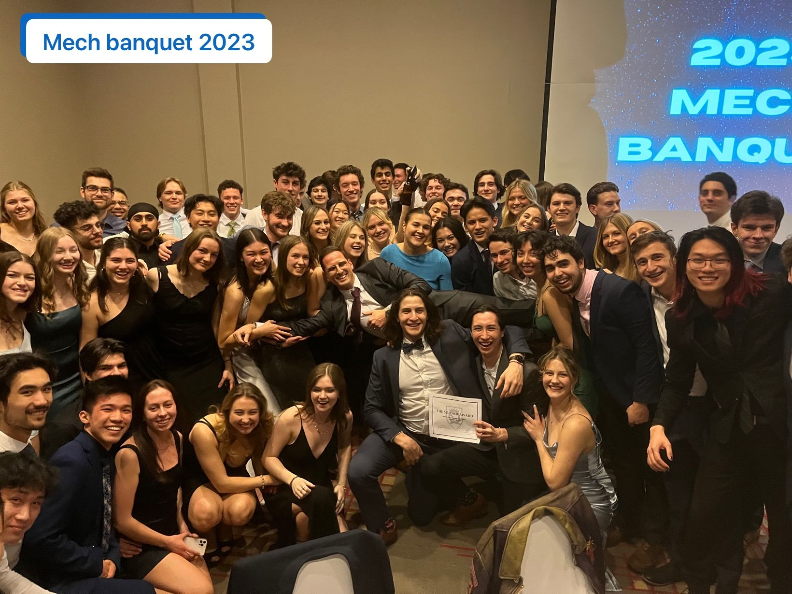

## The MME Banquet 2026 was a night to remember

This year MECH Banquet at Stephen J. R. Smith Faculty of Engineering and Applied Science at Queen's University was a very special one for me. The very first class I have taught fluid mechanics to (back in 2023) is graduating this year!

I want to congratulate with each and every one of you. It's been the best and most rewarding experience to see you grow from very excited (and LOUD!) second year to very talented young professionals.

I wish you all the best for the future, be the best version of yourselves, make sure you check in with your Fluids prof every once in a while, and stop by my office during Home Coming!!

Ad maiora semper ...

(I am sorry for those who got cut in the old picture, we really were TOO MANY!)

